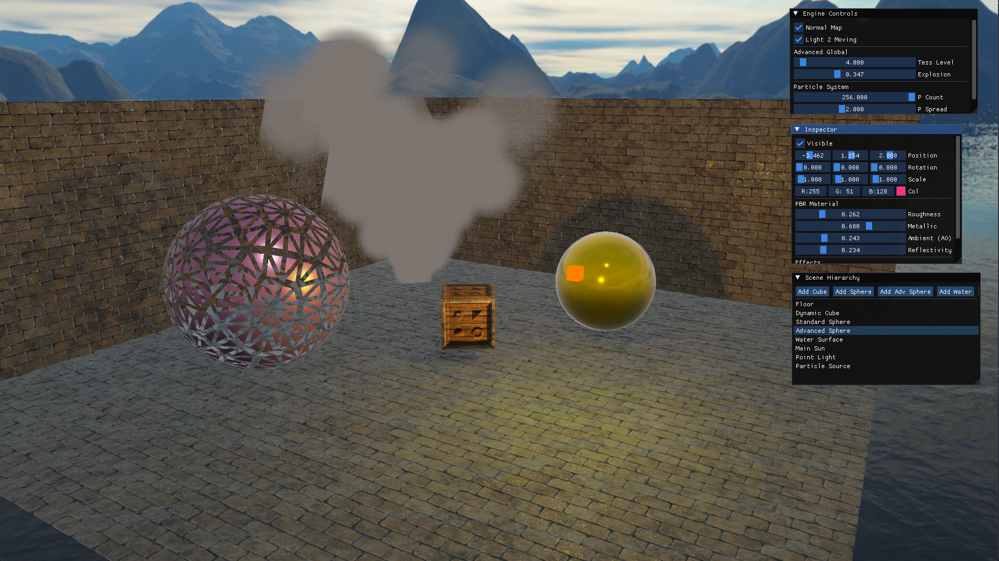

# Mitai Game Engine (OpenGL 4.5)



這是一個基於物理性渲染 (PBR) 架構的 3D 渲染引擎，整合了基於影像的照明 (IBL) 與動態水體模擬技術。
This is a 3D rendering engine built on a Physically Based Rendering (PBR) architecture, integrating Image-Based Lighting (IBL) and dynamic water surface simulation.


---

## 渲染管線說明 | Rendering Pipeline

### 1. 環境光預計算 | Image-Based Lighting Baking
系統在啟動時會透過離線管線將立方體貼圖（Skybox）烘焙為具備物理能量的環境光源：
The system utilizes an offline pipeline at startup to bake the Skybox into physical light sources:
*   **Diffuse IBL**: 生成 Irradiance Map 提供環境漫反射。
    Generates the Irradiance Map for ambient diffuse lighting.
*   **Specular IBL**: 使用 GGX 重要性採樣生成 Prefilter Map 與 BRDF LUT。
    Uses GGX Importance Sampling to generate the Prefilter Map and BRDF LUT.

### 2. 核心光照模型 | Core Lighting Model
實作 Cook-Torrance BRDF 微表面模型，確保材質表現符合物理規律：
Implements the Cook-Torrance BRDF microfacet model to ensure physically accurate material representation:
*   **NDF (法線分佈)**: Trowbridge-Reitz GGX。
*   **Geometry (幾何遮蔽)**: Smith's Schlick-GGX。
*   **Fresnel (菲涅耳)**: Schlick's Approximation，支援金屬反射染色（Tinting）。

### 3. 直接與間接光合併 | Hybrid Lighting Integration
引擎強制執行「高光疊加優先權」，確保分析光源的高光能穿透環境倒影：
The engine enforces "Specular Primacy" to ensure analytical light highlights penetrate environment reflections:
```glsl
// 直接光源 (Analytical Lights) 與 間接環境光 (IBL) 的疊加邏輯
// Merging logic for Analytical Lights and IBL
vec3 directLo = (kD * albedo / PI + SpecularResult) * lightColor * Intensity;
vec3 specularIBL = prefilteredColor * (F0 * envBRDF.x + envBRDF.y) * reflectivity;
vec3 finalColor = directLo + (kD_ibl * diffuseIBL + specularIBL);
```

### 4. 線性工作流與後製 | Linear Workflow & Post-Processing
*   **sRGB Linearization**: 所有輸入貼圖均經過 Gamma 補償轉為線性空間計算。
*   **Tone Mapping**: 使用 Reinhard 算法壓縮高動態範圍，防止過曝。
*   **Gamma Correction**: 最終輸出進行 2.2 Gamma 校正以符合螢幕顯示標準。

---

## 技術功能亮點 | Key Technical Features

### 進階幾何與同步陰影 | Advanced Geometry & Synchronized Shadowing (New)
*   **Tessellation球面化**: 實作動態細分，將正二十面體轉化為精確球面。
    Dynamic tessellation converting icosahedrons into accurate spheres.
*   **同步位移陰影**: 太陽陰影與點光源陰影均支援 Tessellation 位移同步，確保影子表現與模型一致。
    Both sun and point light shadows support tessellation-synchronized displacement.
*   **絕對外擴爆炸**: 修復法線順序問題，實作物理正確的幾何爆炸效果。
    Fixed normal orientation for physically accurate geometric explosion.

### 工業級 PBR 標準 | Industrial PBR Standards
*   **UE4-style IBL**: 符合工業標準的 Split Sum Approximation 實作。
*   **Dynamic Water**: 雙層法線捲動與基於反射率的透明度控制。
*   **Point Light Shadows**: 實作點光源全向深度 Cubemap 陰影。

---

## 操作指南 | User Manual
*   **Roughness (粗糙度)**: 0.05 為鏡面，1.0 為完全消光。
*   **Metallic (金屬度)**: 控制反射染色與漫反射吸收。
*   **Reflectivity (反射率)**: 獨立調製環境倒影強度。
*   **Advanced Global**: 在引擎面板中使用 `Tess Level` 與 `Explosion` 控制進階效果。
*   **Tab**: 切換滑鼠捕獲模式。

---

## 編譯與執行 | Build & Run
1. 執行 `build.ps1` 進行編譯。 / Execute `build.ps1` to compile.
2. 執行 `bin/GameEngine.exe`。 / Run the generated binary.
